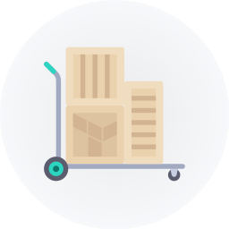

<!-- markdownlint-configure-file {
  "MD013": {
    "code_blocks": false,
    "tables": false
  },
  "MD033": false,
  "MD041": false
} -->

# Terralist

[](https://github.com/terralist/terralist/releases/latest)

<div align="center" markdown="1">
  
  <br/><br/>
  <b>A <i>truly</i> private Terraform registry</b>
</div>

## About

Terralist is a private Terraform registry for providers and modules that follows the published HashiCorp protocols. It provides:
* A secure way to distribute your confidential modules and providers;
* [_Soon_] A management interface to visualize documentation;

## Highlights

* **Login Functionality** ([docs](https://www.terraform.io/docs/internals/login-protocol.html)): Require a token to access the data. It is integrated with Terraform, so you can authenticate to the registry directly through Terraform:
  ```
  terraform login registry.terralist.io
  terraform logout registry.terralist.io
  ```
  It can also generate custom API keys for an authenticated user, which can be used in pipelines to upload and delete modules and in providers to fetch data.

* **Modules Registry**: ([docs](https://www.terraform.io/docs/internals/module-registry-protocol.html)) Stores modules data in a *private* storage (for example, an S3 bucket). When a download request is received, it calls the remote storage to generate a temporary public download URL and forwards it to the requester.

  Currently supported private storage:
  * AWS S3: uses a private S3 bucket
  * Azure Blob: uses a private Azure Storage Account
  * GCS: uses a private Google Storage bucket
  * Proxy: forwards the URL received at creation

* **Provider Registry**: ([docs](https://www.terraform.io/docs/internals/provider-registry-protocol.html)) Similar with modules registry.
  Currently supported private storage:
  * AWS S3: uses a private S3 bucket
  * Azure Blob: uses a private Azure Storage Account
  * GCS: uses a private Google Storage bucket
  * Proxy: forwards the URL received at creation

_Note_: For _Proxy_ storage mode, the URL management is up to you. If, for example, you are providing a git URL, then the same URL will be forwarded to the requester (Terraform).

_Note_: Terralist uses the same library Terraform uses to make downloads ([go-getter](https://github.com/hashicorp/go-getter)), meaning that you can still use your [favorite protocols](https://github.com/hashicorp/go-getter#supported-protocols-and-detectors) while using Terralist. This is also an advantage for the _Proxy_ mode users, which can use the same source that they would normally put in Terraform.

## Disclaimer

This project is not meant to replace the public Terraform Registry. Its purpose is to mimic the public registry in a private environment.

## Documentation

Check the official documentation on [www.terralist.io](https://www.terralist.io/).

## Contributions

All contributions are welcome. If you want to contribute, open an issue or fork the repository and open a PR.
