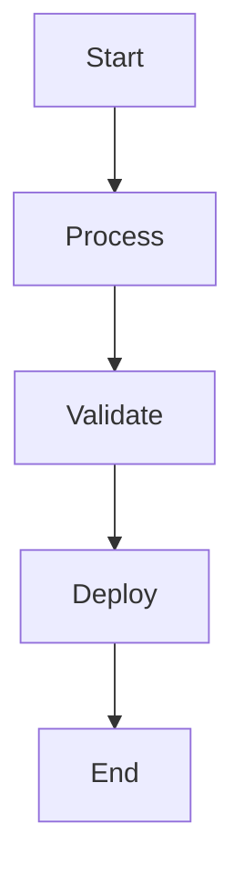

# Artifacts Documentation

Terralist generates and renders documentation for the artifacts it stores. You can either bring your own documentation or let Terralist generate it automatically.

## Modules

Module documentation consists of a single Markdown file. Users can bring their own documentation by bundling a `README.md` file with the module before uploading it to Terralist.

If you'd like Terralist to automatically generate module documentation for you, here's what happens:

1. Terralist unzips your module files locally.
2. The files are processed using [terraform-config-inspect](https://github.com/hashicorp/terraform-config-inspect).
3. The generated Markdown is pushed to the storage provider and served on each request (either rendered in the UI or returned via the API).

!!! warning "If, by any means, Terralist is unable to process the module and generate the documentation for it, the upload will NOT fail. The module archive will still be uploaded without documentation and a warning log will be produced."

Terralist will attempt to find a `README.md` before generating the documentation on its own. To properly detect which `README.md` file is the correct one, it will recursively traverse the directory tree. The first parent node which contains any `*.tf` file will be considered a root module, and, if this directory contains a `README.md` file, the file will be selected and used as documentation.

!!! note "If the archive contains multiple subdirectories, and at least two of them have `*.tf` files (and a `README.md` file), it is undetermined which one will be selected as the 'root module' - depending on how the OS sorts the directories."

## Providers

Provider documentation is still in progress. It will be available soon!

## README Rendering Features

Terralist provides rich rendering capabilities for README files with performance-optimized loading:

### Code Syntax Highlighting

Terralist supports syntax highlighting for code blocks using [Shiki](https://shiki.style/), a modern syntax highlighter. Supported languages include:

- **Programming Languages**: JavaScript, TypeScript, Python, Go, Rust, Java, C/C++, and many more
- **Infrastructure as Code**: Terraform (HCL), YAML, JSON, Bash scripts
- **Markup Languages**: HTML, CSS, Markdown

Code blocks are automatically detected and highlighted when present in README files. For optimal performance, syntax highlighting libraries are loaded from CDN only when code blocks are detected in the content.

```terraform
# Example Terraform code block
resource "aws_instance" "example" {
  ami           = "ami-0c55b159cbfafe1d0"
  instance_type = "t2.micro"

  tags = {
    Name = "Example instance"
  }
}
```

### Mermaid Diagrams

Terralist supports diagram creation using [Mermaid](https://mermaid.js.org/), a JavaScript-based diagramming library. Supported diagram types include:

- **Flowcharts**: Graph and flowchart diagrams
- **Sequence Diagrams**: Interaction diagrams
- **State Diagrams**: Finite state machine diagrams
- **Class Diagrams**: Object-oriented design diagrams
- **Entity Relationship Diagrams**: Database schema diagrams

Mermaid diagrams are automatically detected and rendered when present in README files. For optimal performance, the Mermaid library is loaded from CDN only when diagram code blocks are detected in the content.



### Emoji Shortcode Support

README files support emoji shortcodes using the [node-emoji](https://github.com/omnidan/node-emoji) library. You can use GitHub-style emoji shortcodes that are automatically converted to Unicode emojis:

- `:smile:` → 😄
- `:rocket:` → 🚀
- `:warning:` → ⚠️
- `:bulb:` → 💡
