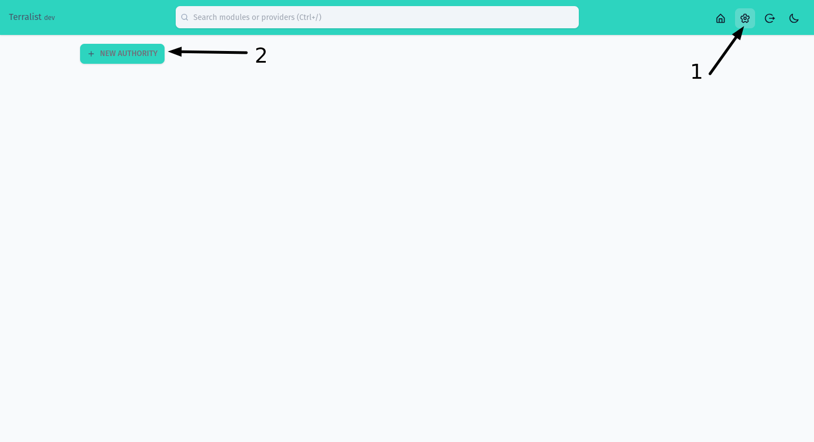
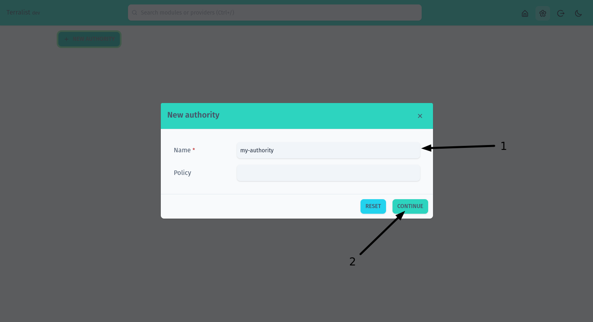

# Getting Started

If you're following this documentation as a step-by-step guide, it is recommended to read the [installation](./installation.md) document first.

## Configure the OAuth provider

Terraform authenticates users with [OAuth 2.0](https://oauth.net/2/). You will need credentials of an OAuth Application from one of the supported providers:

- [GitHub](https://docs.github.com/en/developers/apps/building-oauth-apps/creating-an-oauth-app)
- [BitBucket](https://developer.atlassian.com/cloud/bitbucket/oauth-2/)
- [GitLab](https://docs.gitlab.com/ee/integration/oauth_provider.html#create-an-instance-wide-application)
  <br/>The `email` and `openid` scopes must be assigned for the GitLab OAuth application
- [OpenID Connect](https://openid.net/specs/openid-connect-core-1_0.html#CodeFlowAuth)

!!! note "For local development, you can set the homepage URL to `http://localhost:5758` and the callback URL to `http://localhost:5758/v1/api/auth/redirect`."

!!! note "The port `5758` is the default. If you decide to change it, you will also need to change it in the OAuth App settings."

## Launch the server

Once you have the executable, create a new configuration file to add the minimum required configuration.
While Terralist can be highly configured, the following settings are required and Terralist cannot operate without them:

- `oauth-provider`: the OAuth provider you wish to use for your instance (e.g. `github`).
- the OAuth provider configuration: it depends on what provider you selected (e.g. for GitHub, `gh-client-id` and `gh-client-secret`);
- `token-signing-secret`: a random string to protect the tokens;
- `cookie-secret`: a random string to protect the cookies;

```yaml title="config.yaml"
oauth-provider: github
gh-client-id: ${GITHUB_OAUTH_CLIENT_ID:default}
gh-client-secret: ${GITHUB_OAUTH_CLIENT_SECRET:default}
token-signing-secret: secret
cookie-secret: secret
```

!!! warning "The command above will create a configuration file that is instructing Terralist to read the GitHub OAuth credentials from the `GITHUB_OAUTH_CLIENT_ID` and `GITHUB_OAUTH_CLIENT_SECRET` environment variables. If those variables are not set in your environment, Terralist will start, but it will be unusable (as you cannot login)."

If you are using OpenID Connect, prefer discovery via `oi-host` instead of configuring the authorize, token, and userinfo endpoints manually:

```yaml title="config.yaml"
oauth-provider: oidc
oi-client-id: ${OIDC_CLIENT_ID}
oi-client-secret: ${OIDC_CLIENT_SECRET}
oi-host: https://login.example.com/realms/platform
token-signing-secret: secret
cookie-secret: secret
```

!!! note "When `oi-host` is set, Terralist reads the OIDC discovery document from `/.well-known/openid-configuration`, derives the authorize/token/userinfo endpoints automatically, and verifies that the provider supports the required `openid` and `email` scopes."

!!! note "The manual `oi-authorize-url`, `oi-token-url`, and `oi-userinfo-url` options still exist as a fallback for providers that do not expose OIDC discovery, but `oi-host` is the recommended format."

Then, you can start the Terralist server:

=== "UNIX & UNIX-like"

    ``` shell
    ./terralist server --config config.yaml
    ```

=== "Windows"

    ``` powershell
    .\terralist.exe server --config config.yaml
    ```

=== "Docker"

    ``` shell
    docker run --rm -it -p 5758:5758 -v ${PWD}:/app ghcr.io/terralist/terralist server --config /app/config.yaml
    ```

If the server correctly started, you should see the following log line:

```json
{
  "level": "info",
  "time": "---",
  "message": "Terralist started, listening on port 5758"
}
```

## Interacting with Terraform/OpenTofu

Since the Terraform/OpenTofu CLI expects all responses to be from an HTTPS server, the standard `localhost:5758` will not work for registry interactions.

In order to enable this, you should expose the Terralist server with an HTTPS endpoint. See [local development](./dev-guide/local-development.md) for the available options.

## CLI Authentication

You can authenticate in Terralist by using the `login` subcommand:

=== "Terraform"

    ``` shell
    terraform login localhost:5758
    ```

=== "OpenTofu"

    ``` shell
    tofu login localhost:5758
    ```

## Create an authority

Authorities represent namespaces in Terralist. Every authority can have modules and providers uploaded to it.

To create a new authority, use the web dashboard. Access your Terralist instance by opening a browser and navigating to your `TERRALIST_URL` address (by default, it should be [http://localhost:5758](http://localhost:5758)).

=== "Go to the settings page"

    

    Open the settings page (step 1) and then press on the `New Authority` button (step 2).

=== "Fill the Authority form"

    

    Fill in your authority details. Only the name is required (step 1). When you are done, press on the `Continue` button (step 2).

    !!! note "Terralist is case insensitive, so it doesn't matter if you choose to use upper-case letters here, but then you want to use lower-case letters in your TF files."

!!! warning "Once you have your authority, if you're planning to use it to host custom providers, you should add a signing key. Providers are signed with a GPG key and Terraform/OpenTofu use this registry-provided signing key to validate the authenticity of the newly downloaded provider."

## Generate an API Key

API keys in Terralist are not tied to a specific authority. Each API key carries its own RBAC policies that define which resources, actions, and objects it can access, and a scope for organizational grouping. You can restrict it to a specific authority by using those policies.

To create a new API key, navigate to the Settings page and use the API Keys section. You will need to provide:

- **Name**: a human-readable name for the key.
- **Scope**: an organizational label (e.g. `team-a`, `infra`, `ci-deploy`). Used for RBAC access control on the key itself.
- **Policies**: one or more rules defining what the key can access (resource, action, object, effect).

!!! note "If you're following this guide step-by-step, create an API key with the following policy to allow uploading modules and providers to your authority: resource `*`, action `*`, object `my-authority/*`, effect `allow`. Copy the generated key and export it as the `TERRALIST_API_KEY` environment variable."

!!! note "Access to API key management requires RBAC permission on the `api-keys` resource. The built-in `role:admin` grants this by default. See the [RBAC configuration](./user-guide/rbac-configuration.md) for details."

### Bootstrapping with a master API key

For automated setups (CI/CD pipelines, scripted deployments), you can configure a master API key that has full administrative access without requiring a web UI login:

```yaml title="config.yaml"
master-api-key: "your-secret-master-key"
```

This key can be used via the `Authorization: Bearer x-api-key:<key>` header or the `X-API-Key` header to create authorities, upload modules/providers, and manage API keys programmatically.

## Upload a new module

To upload a new module, use Terralist's API:

```console
curl -X POST http://localhost:5758/v1/api/modules/my-authority/my-module/provider/1.0.0/upload \
     -H "Authorization: Bearer x-api-key:$TERRALIST_API_KEY" \
     -d '{ "download_url": "/home/bob/terraform-modules/example-module" }'
```

!!! note "Terralist uses the same library Terraform uses to make downloads [go-getter](https://github.com/hashicorp/go-getter), so the above example takes advantage of the fact that Terralist runs on your local computer and uses the local getter to "download" the module. If your Terralist server is deployed remotely, the above command should not work (since that particular path cannot resolve on the remote server)."

### Use the module

```hcl
module "example-module" {
  source  = "localhost:5758/my-authority/my-module/provider"
  version = "1.0.0"

  // ...
}
```

## Upload a new provider

To upload a new provider, use Terralist's API. First, create a payload file:

```json title="random-2.0.0.json"
{
  "protocols": ["4.0", "5.1"],
  "shasums": {
    "url": "https://releases.hashicorp.com/terraform-provider-random/2.0.0/terraform-provider-random_2.0.0_SHA256SUMS",
    "signature_url": "https://releases.hashicorp.com/terraform-provider-random/2.0.0/terraform-provider-random_2.0.0_SHA256SUMS.sig"
  },
  "platforms": [
    {
      "os": "darwin",
      "arch": "amd64",
      "download_url": "https://releases.hashicorp.com/terraform-provider-random/2.0.0/terraform-provider-random_2.0.0_darwin_amd64.zip",
      "shasum": "55ced41e5f68730ef36272d4953f336a50f318c1d1d174665f5fa76cb5df08ae"
    },
    {
      "os": "linux",
      "arch": "amd64",
      "download_url": "https://releases.hashicorp.com/terraform-provider-random/2.0.0/terraform-provider-random_2.0.0_linux_amd64.zip",
      "shasum": "5f9c7aa76b7c34d722fc9123208e26b22d60440cb47150dd04733b9b94f4541a"
    }
  ]
}
```

Then, call the API to upload it:

```console
curl -X POST localhost:5758/v1/api/providers/my-authority/random/2.0.0/upload \
     -H "Authorization: Bearer x-api-key:$TERRALIST_API_KEY" \
     -d "$(cat random-2.0.0.json)"
```

!!! note "In order for this provider to be fully validated by Terraform/OpenTofu, you should add the public GPG key of the provider signer to your authority."

### Use the provider

```hcl
terraform {
  required_providers {
    random = {
      source  = "localhost:5758/my-authority/random"
      version = "2.0.0"
    }
  }
}
```
