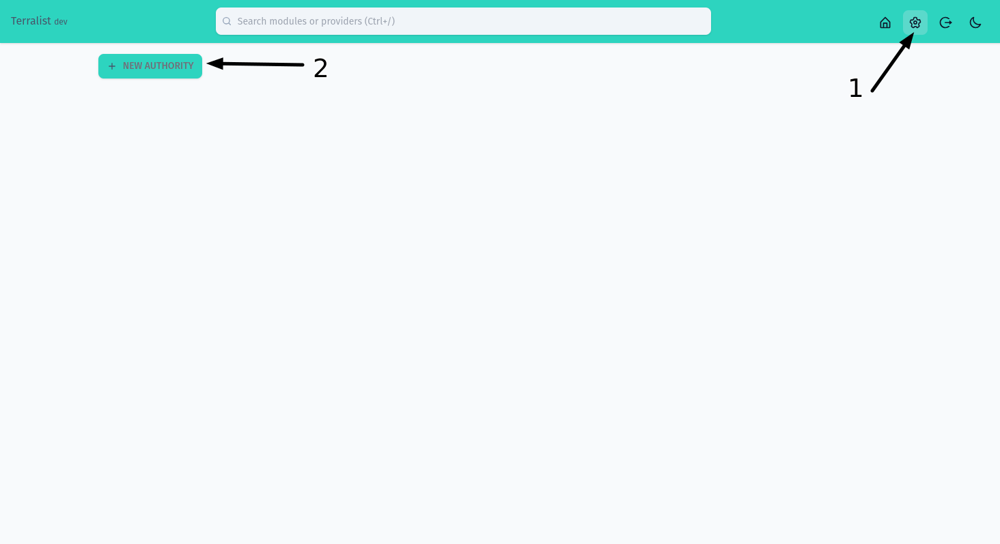

# Getting Started

If you're following this documentation as a step-by-step guide, it is recommended to read the [installation](./installation.md) document first.

## Configure the Oauth provider

Terraform authenticates users with [Oauth 2.0](https://oauth.net/2/). You will need credentials of an Oauth Application from our supported providers:

- [GitHub](https://docs.github.com/en/developers/apps/building-oauth-apps/creating-an-oauth-app)
- [BitBucket](https://developer.atlassian.com/cloud/bitbucket/oauth-2/)
- [GitLab](https://docs.gitlab.com/ee/integration/oauth_provider.html#create-an-instance-wide-application)
  <br/>The `email` and `openid` scopes must assigned for the GitLab Oauth application
- [OpenID Connect](https://openid.net/specs/openid-connect-core-1_0.html#CodeFlowAuth)

!!! note "For local development, you can set the homepage URL to `http://localhost:5758` and the callback URL to `http://localhost:5758/v1/api/auth/redirect`."

!!! note "The port `5758` is the default. If you decide to change it, you will also need to change it in the Oauth App settings."

## Launch the server

Once you have the executable, create a new configuration file to add the minimum required configuration.
While Terralist can be highly configured, the following settings are required and Terralist cannot operate without them:

- `oauth-provider`: the Oauth provider you wish to use for your instance (e.g. `github`).
- the Oauth provider configuration: it depends on what provider you selected (e.g. for GitHub, `gh-client-id` and `gh-client-secret`);
- `token-signing-secret`: a random string to protect the tokens;
- `cookie-secret`: a random string to protect the cookies;


``` yaml title="config.yaml"
oauth-provider: github
gh-client-id: ${GITHUB_OAUTH_CLIENT_ID:default}
gh-client-secret: ${GITHUB_OAUTH_CLIENT_SECRET:default}
token-signing-secret: secret
cookie-secret: secret
```
!!! warning "The command above will create a configuration file that is instructing Terralist to read the GitHub Oauth credentials from the `GITHUB_OAUTH_CLIENT_ID` and `GITHUB_OAUTH_CLIENT_SECRET` environment variables. If those variables are not set in your environment, Terralist will start, but it will be unusable (as you cannot login)."

Then, you can start the Terralist server:

=== "UNIX & UNIX-like"

    ``` shell
    ./terralist server --config config.yaml
    ```

=== "Windows"

    ``` powershell
    .\terralist.exe server --config config.yaml
    ```

=== "Docker"

    ``` shell
    docker run --rm -it -p 5758:5758 -v ${PWD}:/app ghcr.io/terralist/terralist server --config /app/config.yaml
    ```

If the server correctly started, you should see the following log line:
```json
{"level":"info","time":"---","message":"Terralist started, listening on port 5758"}
```

## Interacting with Terraform/OpenTofu

Since the terraform-cli/opentofu-cli expects all responses to be from an HTTPS server, the standard `localhost:5758` will return an error when trying to login.


In order to enable this interaction, you should expose the Terralist server with an HTTPS endpoint. There are multiple options to do such:

- Use Terralist TLS support via the `cert-file` and `key-file` arguments; you will have to bring your own certificate for this (a self-signed certificate also works);
- Expose Terralist behind a reverse-proxy;
- Expose Terralist with a managed reverse-proxy like [ngrok](https://ngrok.com/docs/);

See [local development](./dev-guide/local-development.md) for more details.

## CLI Authentication

You can authenticate in Terralist by using the `login` subcommand:

=== "Terraform"

    ``` shell
    terraform login localhost:5758
    ```

=== "OpenTofu"

    ``` shell
    tofu login localhost:5758
    ```

## Create an authority

Authorities represents namespaces in Terralist. Every authority can have modules and providers which can be uploaded to Terralist by using an authority API key. 

!!! note "You may notice that during the upload process of modules and providers you are not asked to input the namespace. This is happening because Terralist will decide the namespace based on your authorization token."

To create a new authority, you must use the web dashboard. Access your Terralist instance by opening a browser and navigating to your `TERRALIST_URL` address (by default, it should be [http://localhost:5758](https://localhost:5758)).

=== "Go to the settings page"

    

    Open the settings page (step 1) and then press on the `New Authority` button (step 2).

=== "Fill the Authority form"

    

    Fill in your authority details. Only the name is required (step 1). When you are done, press on the `Continue` button (step 2).

    !!! note "Terralist is case insensitive, so it doesn't matter if you choose to use upper-case letters here, but then you want to use lower-case letters in your TF files."

!!! warning "Once you have your authority, if you're planning to use it to host custom providers, you should add a signing key. Providers are signed with a GPG key and Terraform/OpenTofu use this registry-provided signing key to validate the authenticity of the newly downloaded provider."

## Generate an API Key

To create a new API key, you must use the web dashboard. Access your Terralist instance by opening a browser and navigating to your `TERRALIST_URL` address (by default, it should be [http://localhost:5758](https://localhost:5758)), then navigate to the Settings page.

=== "Create an API key"

    

    Under your authority, press on the "+" sign (step 1) to create a new API key. A confirmation modal should open, awaiting for your confirmation. Press `Continue` (step 2).

=== "View the API key"

    

    Once you have the API key, you can open a modal to view it. Press on the arrow down symbol (step 1) to open the API keys list for your authority, then press the eye symbol to open the view modal (step 2).

=== "Copy the API key"

    

    You can use this modal view to check the value of your API key.

    !!! note "If you read this documentation as a step-by-step guide, copy this API key and export it as `TERRALIST_API_KEY` environment variable."

## Upload a new module

To upload a new module, you can use Terralist's API:

``` console
curl -X POST http://localhost:5758/v1/api/modules/my-module/provider/1.0.0/upload \
     -H "Authorization: Bearer x-api-key:$TERRALIST_API_KEY" \
     -d '{ "download_url": "/home/bob/terraform-modules/example-module" }'
```

!!! note "Terralist uses the same library Terraform uses to make downloads [go-getter](https://github.com/hashicorp/go-getter), so the above example takes advantage of the fact that Terralist runs on your local computer and uses the local getter to "download" the module. If your Terralist server is deployed remotely, the above command should not work (since that particular path cannot resolve on the remote server)."


### Use the module
``` hcl
module "example-module" {
  source  = "localhost:5758/my-authority/my-module/provider"
  version = "1.0.0"

  // ...
}
```

## Upload a new provider

To upload a new module, you can use Terralist's API. First, create a payload file:

``` json title="random-2.0.0.json"
{
  "protocols": [
    "4.0",
    "5.1"
  ],
  "shasums": {
    "url": "https://releases.hashicorp.com/terraform-provider-random/2.0.0/terraform-provider-random_2.0.0_SHA256SUMS",
    "signature_url": "https://releases.hashicorp.com/terraform-provider-random/2.0.0/terraform-provider-random_2.0.0_SHA256SUMS.sig"
  },
  "platforms": [
    {
      "os": "darwin",
      "arch": "amd64",
      "download_url": "https://releases.hashicorp.com/terraform-provider-random/2.0.0/terraform-provider-random_2.0.0_darwin_amd64.zip",
      "shasum": "55ced41e5f68730ef36272d4953f336a50f318c1d1d174665f5fa76cb5df08ae"
    },
    {
      "os": "linux",
      "arch": "amd64",
      "download_url": "https://releases.hashicorp.com/terraform-provider-random/2.0.0/terraform-provider-random_2.0.0_linux_amd64.zip",
      "shasum": "5f9c7aa76b7c34d722fc9123208e26b22d60440cb47150dd04733b9b94f4541a"
    }
  ]
}
```

Then, call the API to upload it:

``` console
curl -X POST localhost:5758/v1/api/providers/random/2.0.0/upload \
     -H "Authorization: Bearer x-api-key:$TERRALIST_API_KEY" \
     -d "$(cat random-2.0.0.json)"
```

!!! note "In order for this provider to be fully validated by Terraform/OpenTofu, you should add the public GPG key of HashiCorp to your authority."

### Use the provider
``` hcl
terraform {
  required_providers {
    random = {
      source  = "localhost:5758/my-authority/random"
      version = "2.0.0"
    }
  }
}
```
